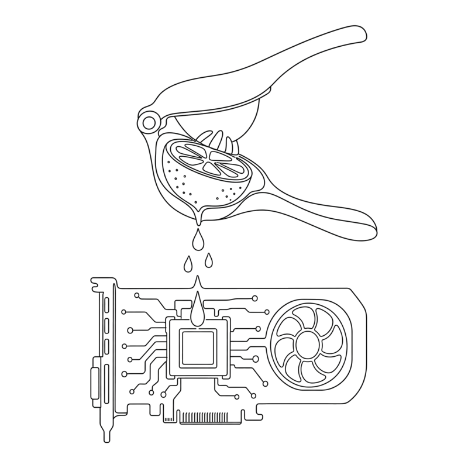

<table border="0" cellspacing="0" cellpadding="0">
<tr>
<td width="220" valign="middle">
<picture>
<source media="(prefers-color-scheme: dark)" srcset="docs/assets/logo-dark.png">

</picture>
</td>
<td valign="middle"><h1>L&nbsp;E&nbsp;M&nbsp;O&nbsp;N &nbsp; S&nbsp;Q&nbsp;U&nbsp;E&nbsp;E&nbsp;Z&nbsp;E&nbsp;R</h1></td>
</tr>
</table>

**Reproducible benchmarks for open-weight coding agents — squeezing real work out of models you don't have to ask permission to use.**

Frontier access is fragile. When Fable 5 was suspended on 2026-06-12 by an export-control directive, every app built on it broke overnight. The question this repo answers: **how close can open-weight models get — and where should you run them?**

Two venues, one benchmark:

| | **Local** | **Cloud (open-weight)** |
|---|---|---|
| Hardware | RTX 4070 (12 GB) + Ollama | rented on [OpenRouter](https://openrouter.ai) |
| Cost | electricity | ~$0.001–0.05 per task |
| Privacy | total (offline) | none |
| Ceiling | ~30B models | 480B+ frontier-open (DeepSeek V4, Qwen3-Max, Kimi K2, GLM-5) |
| Driver | `bin/eval-run` | `bin/cloud-run` / `bin/cloud-matrix` |

Same prompts, same rubrics, different venue. That's the whole point — every result here is the *same agent* (`squeezer`) doing the *same task*, scored by the *same code*, so local-vs-cloud and model-vs-model are honest comparisons.

## Two headline findings

**1. (Local) The harness matters more than the model.** Same `qwen3:14b` on `bug-fix`:
pi → 27% (the model botches exact-string-match edits) vs aider → 100% (whole-file rewrites sidestep the failure mode). A weak model with the right harness beats a strong model with the wrong one.

**2. (Cloud) The "Fable destroyer" is a single cheap open model — not a clever mix.** Across 751 runs (18 arms × 16 evals), `deepseek-v4-flash` scored **100% at ~$0.0018/task**, and `gpt-oss-120b` is the value king (95% at **$0.0005/task**). The multi-model mixes (architect / critique / ensemble / verify) mostly *lost* to the best single — they're a **weak-model rescue kit** (a critic loop drags `qwen3-coder-30b` from 69%→94%), not a quality-ceiling raiser. Full writeup in [FINDINGS-CLOUD.md](FINDINGS-CLOUD.md); live [dashboard](https://noahjohnson0.github.io/lemon-squeezer/cloud). For context, the **RTX 4070 hits 97%** on the same tasks with the right harness.

## How it works

Everything runs through **one agent**, `bin/squeezer.py` — a ~250-line, dependency-free tool-calling loop (`read_file` / `write_file` / `list_files` / `run_bash`) that talks to any OpenAI-compatible endpoint. Point it at local Ollama or at OpenRouter; the only thing that changes is the base URL and the model slug.

```
        prompt.md ──► squeezer agent ──► workspace/ ──► rubric.sh ──► score%
                          │                                              │
              local Ollama │ OR │ OpenRouter                    runs.jsonl (source of truth)
```

A **mix** (`bin/squeezer_pipeline.py`) wires several models in sequence over one
workspace — e.g. a frontier model writes the plan, a cheap model implements it.

### Run one task

```bash
# Local, on the 4070:
bin/eval-run aider bug-fix qwen3-coder:30b-a3b-q4_K_M baseline

# Cloud, a single open model on OpenRouter ($OPENROUTER_API_KEY):
bin/cloud-run dijkstra deepseek/deepseek-v4-pro

# Cloud, a multi-model MIX (frontier brain plans, cheap hands implement):
bin/cloud-run dijkstra --pipeline architect \
    --primary-model qwen/qwen3-coder-30b-a3b-instruct \
    --architect-model deepseek/deepseek-v4-pro
```

Each run writes a per-run dir (workspace, chat history, token/cost counts, score)
and appends one line to `runs.jsonl`.

### Run the whole experiment

```bash
# Every arm (singles + mixes) × the eval suite × N trials, in parallel,
# with a single safe writer and a hard USD budget cap:
bin/cloud-matrix --trials 3 --budget 9 --concurrency 8

# Leaderboard: mean score, $/run, and score-per-dollar:
bin/cloud-report --tag fable-hunt --by-eval
```

The arms under test (single models + mixes) live in
[`configs/cloud-arms.json`](configs/cloud-arms.json) — edit it to add a model.

## Eval anatomy

Each eval is three files in `evals/<name>/`:

- `prompt.md` — the natural-language task given to the agent
- `rubric.sh` — runs the produced code and prints `{checks: [...], score_pct: N}` JSON
- `setup.sh` *(optional)* — drops starter files into the workspace first

Rubrics weigh **runtime correctness** (does the code actually run and produce the
right answer?) over structural checks. A model that hallucinates a working-looking
program but fails on real input loses most of its points. The suite spans
algorithms (dijkstra, huffman, regex-engine), systems (rate-limiter, lru-cache),
numerics (kalman-filter, fft-spectrum), and bug-fixing.

## Repo map

```
lemon-squeezer/
├── bin/
│   ├── squeezer.py          # the agent — one tool-calling loop, any endpoint
│   ├── squeezer_pipeline.py # multi-model mixes (architect/critique/ensemble/verify)
│   ├── eval-run             # LOCAL runner (4070/Ollama), GPU-locked + telemetry
│   ├── cloud-run            # CLOUD runner (OpenRouter) — single model or a mix
│   ├── cloud-matrix         # drive all arms × suite × trials, budgeted + parallel
│   ├── cloud-report         # per-arm leaderboard (score, $/run, score-per-$)
│   ├── eval-export          # rebuild runs.csv / RUNS.md / dashboard data
│   └── harnesses/           # local harness shims (pi.sh, aider.sh, squeezer-*.sh)
├── evals/<name>/            # prompt.md + rubric.sh (+ optional setup.sh)
├── configs/cloud-arms.json  # the cloud experiment design (models + mixes)
├── runs.jsonl               # one JSON per run — the source of truth
├── runs/<run_id>/           # per-run workspace + logs + score (gitignored)
└── dashboard-next/          # Next.js dashboard → GitHub Pages
```

## Dashboard

`dashboard-next/` is a static Next.js export published to
[noahjohnson0.github.io/lemon-squeezer](https://noahjohnson0.github.io/lemon-squeezer/).
It reads `runs.jsonl` directly — the **/** page is the local 4070 leaderboard, the
**/cloud** page is the local-vs-cloud and Fable-destroyer view. For local dev:
`cd dashboard-next && bun install && bun run dev`.

## License

MIT.
