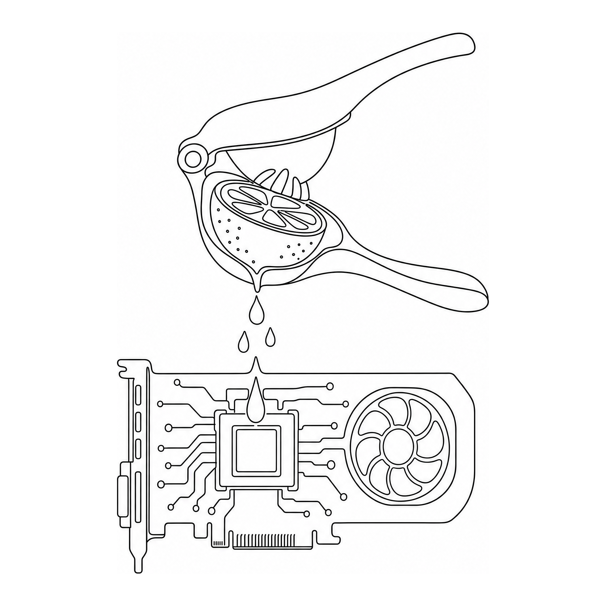

<p align="center">
  
</p>

# lemon-squeezer

Reproducible benchmarks for **local-LLM coding agents** running on a single consumer GPU.

The whole point: figure out which `(model, harness, prompt-config)` combo gives you a usable coding agent that runs entirely on hardware you own. Cloud-frontier results don't tell you whether qwen3-coder on a 4070 can actually finish a task.

Hardware: RTX 4070 (12 GB) running Ollama, accessed over LAN from a Mac. Models tested include qwen3:14b, qwen3-coder:30b-a3b (MoE), gpt-oss:20b (MoE), devstral:24b, gemma4:e4b. Harnesses tested: [pi](https://pi.dev) and [aider](https://aider.chat).

## Headline finding

**The harness matters more than the model.** Same qwen3:14b on `bug-fix`:
- pi → 27% (model botches exact-string-match edits)
- aider → 100%

Aider's whole-file rewrite format sidesteps the failure mode that breaks pi for small local models.

## What's in here

```
lemon-squeezer/
├── bin/                    # Runner + analysis scripts
│   ├── eval-run            # Run a single (harness, eval, model, tag) combo
│   ├── eval-list           # Tabular history
│   ├── eval-diff           # Side-by-side check pass/fail between two runs
│   ├── eval-export         # Regenerate runs.csv + RUNS.md
│   ├── serve               # Local web dashboard
│   └── harnesses/          # Per-harness shims (pi.sh, aider.sh)
├── evals/                  # One dir per eval
│   ├── bug-fix/            # Fix a CSV totaller with hidden bugs
│   ├── cli-tool/           # Build a `wc` clone
│   ├── refactor/           # Extract function from duplicated code
│   ├── wifi-stats/         # Build Next.js + FastAPI dashboard
│   ├── chem-balance/       # Balance chemical equations via linear algebra
│   └── projectile-sim/     # 2D motion w/ quadratic drag, RK4 integrator
├── configs/                # System-prompt augments (--read'd by aider)
├── runs/                   # One dir per run: workspace + session log + score
├── runs.jsonl              # One JSON per run (source of truth)
├── runs.csv                # Same data, spreadsheet-friendly
├── RUNS.md                 # Auto-generated leaderboard + chronological log
└── dashboard.html          # Live web view served by bin/serve
```

## Eval anatomy

Each eval is three files:
- `prompt.md` — the natural-language task given to the agent
- `setup.sh` *(optional)* — drops starter files into the workspace before the agent runs
- `rubric.sh` — runs the agent's output and prints `{checks: [...], score_pct: N}` JSON

Rubrics weigh **runtime correctness** (does the produced code actually run and produce the right answer?) over structural checks. A model that hallucinates a working-looking program but fails on real input loses most of its points.

## Run an eval

```bash
bin/eval-run aider bug-fix qwen3-coder:30b-a3b-q4_K_M baseline
# ✓ 21s | exit=0 | tok in/out=728/148 | tools=0 | score=100%
#   /Users/.../runs/2026-05-10T..._bug-fix_aider_qwen3_coder_30b_a3b_q4_K_M_baseline
```

`bin/eval-run` writes a per-run dir with the produced workspace, the chat history, token counts, wall-clock time, and the rubric score. `runs.csv` and `RUNS.md` regenerate after each run.

To compare two runs: `bin/eval-diff <run_a_id> <run_b_id>`.

To watch live: `bin/serve` then open `http://localhost:8765/dashboard.html`.

## Current state of play

See [RUNS.md](RUNS.md) for the live leaderboard. Current best scores:

| eval | best score | best config |
|---|---|---|
| bug-fix | 100% | aider × any 14B+ model |
| cli-tool | 100% | aider × qwen3:14b / gpt-oss / qwen3-coder |
| refactor | 100% | aider × qwen3:14b OR pi × gpt-oss |
| wifi-stats | 94% | aider × gpt-oss:20b × `sysprompt` |

Work in progress on harder evals (chem-balance, projectile-sim) and a security eval suite.

## Why "lemon-squeezer" not "pi-evals"

Started as a pi-only benchmark. Adding aider made it clear pi's quirks dominate the results, so it's now harness-agnostic.

## License

MIT.
